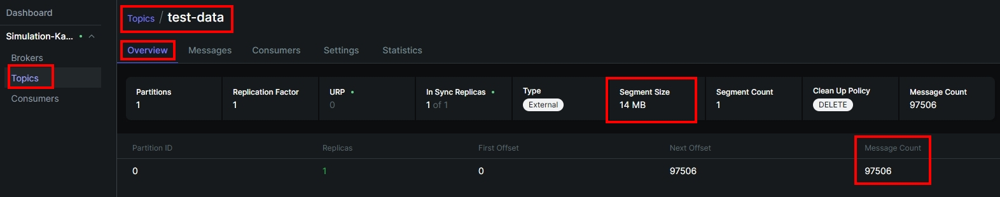
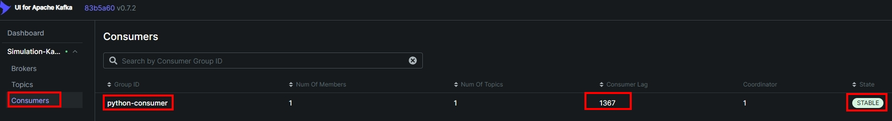

<a href='https://github.com/Junwu0615/Latency-Throughput-Simulation-Test'> <br> 
[](https://go.dev/) 
[](https://www.python.org/) <br>
[](https://www.mongodb.com/)
[](https://redis.io/)
[](https://kafka.apache.org/)
[](https://www.docker.com/) 

<br>

## *⭐ Python ⭐*
- ### *A.　流程運行*
```Text
*Producer → *Kafka → *Consumer → *Redis / *MongoDB

[Data Producer #Python] # producer.py [模擬高頻率資料流產生]
       │
       ▼
 [Kafka Topic: "test-data"]
       │
       ▼
[Data Consumer #Python] 
       │
       ├── Read from Kafka # consumer.py [從 Kafka 消費資料並寫入 Redis / MongoDB]
       │
   ├── Write to Redis [快取]
   └── Write to MongoDB [落地]
```

<br>

- ### *B.　Kafka*
- 
- 
- 
- 
- 

<br>

- ### *C.　MongoDB*
- 
- 

<br>

- ### *D.　Redis*
- 
- 