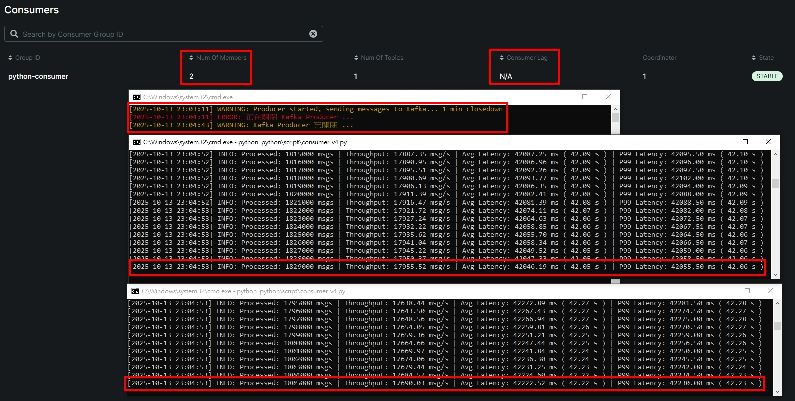

<a href='https://github.com/Junwu0615/Latency-Throughput-Simulation-Test'>   
 
  

 

 

## *⭐ Python vs Golang 語言效能差異比較 ⭐*
### *A.　測試方式*
- #### *[producer] 為期 1 分鐘不休眠傳遞訊息至 Kafka，時間到關閉程序*
- #### *[consumer] 訂閱 Kafka Topic 解析訊號後發送至 Redis & MongoDB*
- #### *期許結果 `consumer >= producer` ; 不預期結果: `consumer < producer`*

 

### *B.　測試指標*
- #### *吞吐量（ Throughput, msgs/sec ） # 每秒處理數據*
- #### *平均延遲（ Average Latency ）# 平均延遲 ? 秒*
- #### *P99 延遲（ P99 Latency ） # 99% 的訊息延遲超過 ? 秒*

 

### *C.　Python 截圖*
- #### *吞吐量 v1: 用 batch 方式塞資料 但還是需要依序等待 I/O*
- 
  - ##### *累計處理訊息 : 1,750,000 msg / s*
  - ##### *⭐ 吞吐量 : 16,449.46 msg / s*
  - ##### *平均延遲 : 47,240.35 ms ( 47.24 s )*
  - ##### *P99 延遲 : 47,257.00 ms ( 47.26 s )*  - 

- #### *吞吐量 v2: 導入 ThreadPoolExecutor # 多執行緒*
- 
  - ##### *累計處理訊息 : 3,897,000 msg / s*
  - ##### *⭐ 吞吐量 : 26,097.25 msg / s*
  - ##### *平均延遲 : 89,505.11 ms ( 89.51 s )*
  - ##### *P99 延遲 : 89,517.58 ms ( 89.52 s )*

- #### *吞吐量 v3: 異步 I/O (Asyncio)*
- 
  - ##### *累計處理訊息 : ... msg / s*
  - ##### *⭐ 吞吐量 : ... msg / s*
  - ##### *平均延遲 : ... ms ( ... s )*
  - ##### *P99 延遲 : ... ms ( ... s )*

- #### *吞吐量 v4: 水平擴展 [2]*
- 
  - ##### *需要設定 kafka 同步使用 Topic 上限*
- 
  - ##### *累計處理訊息 : 3,634,000 msg / s*
  - ##### *⭐ 吞吐量 : 35,645.55 msg / s*
  - ##### *平均延遲 : 42,134.35 ms ( 42.13 s )*
  - ##### *P99 延遲 : 42,142.75 ms ( 42.14 s )*

- #### *吞吐量 v4: 水平擴展 [4]*
- 
  - ##### *累計處理訊息 : 1,549,000 msg / s*
  - ##### *⭐ 吞吐量 : 23,757.4 msg / s*
  - ##### *平均延遲 : 6176.32 ms ( 6.18 s )*
  - ##### *P99 延遲 : 6264.91 ms ( 6.26 s )*

 