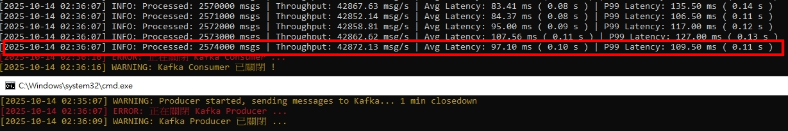
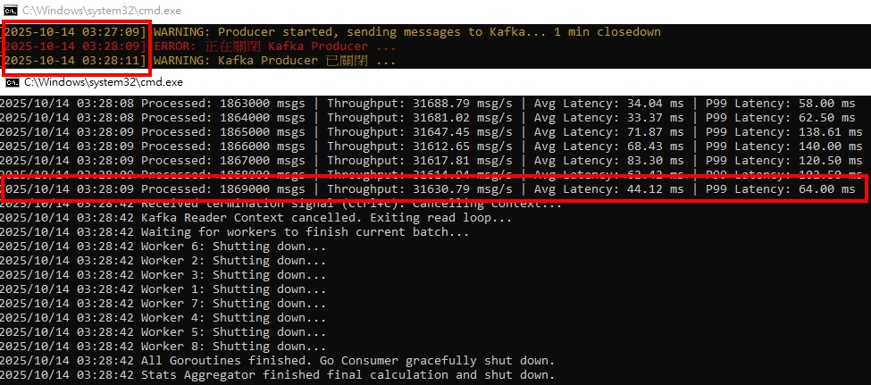

<a href='https://github.com/Junwu0615/Latency-Throughput-Simulation-Test'>   
 
  

 

 

## *⭐ Python vs Golang 語言效能差異比較 (不含數據庫) ⭐*
### *A.　測試方式*
- #### *[producer] 為期 1 分鐘不休眠傳遞訊息至 Kafka，時間到關閉程序*
- #### *[consumer] ⭐ 訂閱 Kafka Topic 解析訊號 ⭐*
- #### *預期結果 `consumer >= producer (消耗速度要大於新增速度)` ; 不預期結果: `consumer < producer`*

 

### *B.　測試指標*
- #### *吞吐量（ Throughput, msgs/sec ） # 每秒處理數據*
- #### *平均延遲（ Average Latency ）# 平均延遲 ? 秒*
- #### *P99 延遲（ P99 Latency ） # 99% 的訊息延遲超過 ? 秒*

 

### *C.　Python 測試結果*
- #### *[ 已拉高 Kafka Topic 上限至 8 ] v5: 不含資料庫*
- 
  - ##### *實例數量 : 1*
  - ##### *累計處理訊息 : 2,574,000 msg / s*
  - ##### *⭐ 吞吐量 :  42,872.13 msg / s*
  - ##### *平均延遲 : 97.10 ms ( 0.10 s )*
  - ##### *P99 延遲 : 109.50 ms ( 0.11 s )*

 

### *D.　Golang 測試結果*
- 
  - ##### *實例數量 : 1*
  - ##### *累計處理訊息 : 1,869,000 msg / s*
  - ##### *⭐ 吞吐量 :  31,630.79 msg / s*
  - ##### *平均延遲 : 44.12 ms ( ... s )*
  - ##### *P99 延遲 : 64.00 ms ( ... s )*
  - 
 