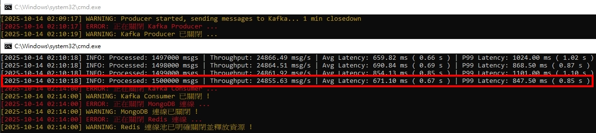
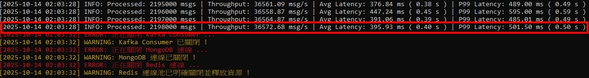
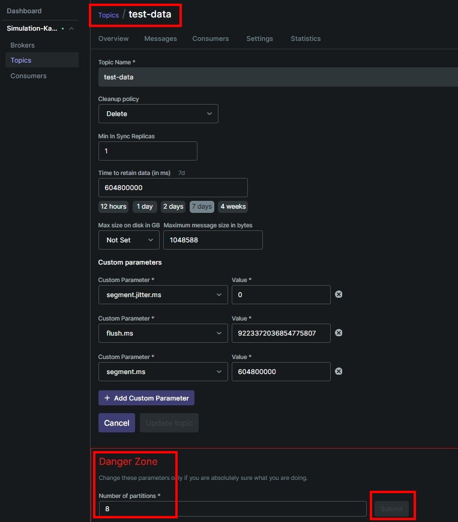

<a href='https://github.com/Junwu0615/Latency-Throughput-Simulation-Test'>   
 
  

 

 

## *⭐ Python vs Golang 語言效能差異比較 ⭐*
### *A.　測試方式*
- #### *[producer] 為期 1 分鐘不休眠傳遞訊息至 Kafka，時間到關閉程序*
- #### *[consumer] 訂閱 Kafka Topic 解析訊號後發送至 Redis & MongoDB*
- #### *預期結果 `consumer >= producer (消耗速度要大於新增速度)` ; 不預期結果: `consumer < producer`*

 

### *B.　測試指標*
- #### *吞吐量（ Throughput, msgs/sec ） # 每秒處理數據*
- #### *平均延遲（ Average Latency ）# 平均延遲 ? 秒*
- #### *P99 延遲（ P99 Latency ） # 99% 的訊息延遲超過 ? 秒*

 

### *C.　Python 測試結果*
- #### *[ 已拉高 Kafka Topic 上限至 8 ] 吞吐量 v1: 用 batch 方式塞資料 但還是需要依序等待 I/O*
- 
  - ##### *實例數量 : 1*
  - ##### *累計處理訊息 : 1,500,000 msg / s*
  - ##### *⭐ 吞吐量 :  24,855.63 msg / s*
  - ##### *平均延遲 : 671.10 ms ( 0.67 s )*
  - ##### *P99 延遲 : 847.50 ms ( 0.85 s )*

- #### *[ 已拉高 Kafka Topic 上限至 8 ] 吞吐量 v2: 導入 ThreadPoolExecutor # 多執行緒*
- 
  - ##### *實例數量 : 1*
  - ##### *累計處理訊息 : 2,198,000 msg / s*
  - ##### *⭐ 吞吐量 : 36,572.68 msg / s*
  - ##### *平均延遲 : 395.93 ms ( 0.40 s )*
  - ##### *P99 延遲 : 501.50 ms ( 0.50 s )*

[//]: # (- #### *吞吐量 v3: 異步 I/O &#40;Asyncio&#41;*)

[//]: # (- ![JPG]&#40;../sample/python_03.jpg&#41;)

[//]: # (  - ##### *累計處理訊息 : ... msg / s*)

[//]: # (  - ##### *⭐ 吞吐量 : ... msg / s*)

[//]: # (  - ##### *平均延遲 : ... ms &#40; ... s &#41;*)

[//]: # (  - ##### *P99 延遲 : ... ms &#40; ... s &#41;*)

- #### *吞吐量 v4: 水平擴展 [8]*
- 
  - ##### *需要設定 kafka 同步使用 Topic 上限*
  - ##### *⭐ Topic 上限拉高有助於大幅提升吞吐速度 ⭐*
    - ##### *將 Topic 分割區增加到 8 個後，單一 Consumer 實例會從這 8 個分割區拉取數據*
    - ##### *在拉取數據時，會從 8 個數據源（分割區）中一次性拉取更大、更飽和的數據批次*
    - ##### *能夠將這個更大的數據批次，更有效率地轉交給後端進行異步寫入*
    - ##### *8 個分割區帶來的超大數據批次，意外地繞開了 Python 的單執行緒瓶頸*
- 
- 
  - ##### *實例數量 : 8*
  - ##### *累計處理訊息 : 1,855,000 msg / s*
  - ##### *⭐ 吞吐量 : 31,079.58 msg / s # 可能是 Redis & Mongo 數據庫瓶頸導致此上限*
  - ##### *平均延遲 : 93.57 ms ( 0.093 s )*
  - ##### *P99 延遲 : 173.25 ms ( 0.173 s )*

 