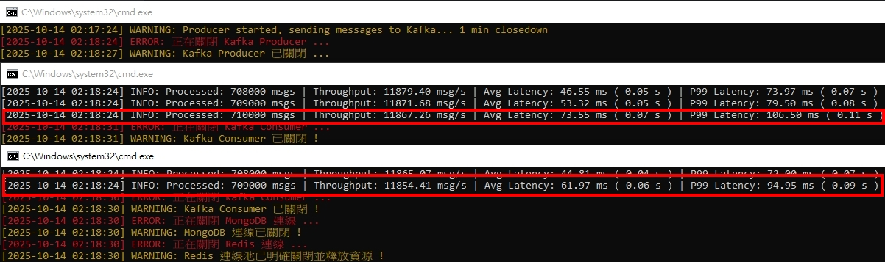

<a href='https://github.com/Junwu0615/Latency-Throughput-Simulation-Test'>   
 
  

 

 

## *⭐ Python vs Golang 語言效能差異比較 ⭐*
### *A.　測試指標*
- #### *吞吐量（ Throughput, msgs/sec ） # 每秒處理數據*
- #### *平均延遲（ Average Latency ）# 平均延遲 ? 秒*
- #### *P99 延遲（ P99 Latency ） # 99% 的訊息延遲超過 ? 秒*

 

### *B.　Python 截圖*

[//]: # (- ![JPG]&#40;../sample/python_00.jpg&#41;)
- #### *吞吐量 v1: 用 batch 方式塞資料 但還是需要依序等待 I/O*
- 
  - #### *吞吐量 : 1941.70 msg / s*
  - #### *平均延遲 : 0.91 ms ( 0.00 s )*
  - #### *P99 延遲 : 6.51 ms ( 0.01 s )*
  - 
- #### *吞吐量 v2: 導入 ThreadPoolExecutor # 多執行緒*
- 
  - #### *吞吐量 : ... msg / s*
  - #### *平均延遲 : ... ms ( ... s )*
  - #### *P99 延遲 : ... ms ( ... s )*

- #### *吞吐量 v3: 異步 I/O (Asyncio)*
- 
  - #### *吞吐量 : ... msg / s*
  - #### *平均延遲 : ... ms ( ... s )*
  - #### *P99 延遲 : ... ms ( ... s )*
  - 
- #### *吞吐量 v4: 水平擴展*
- 
  - #### *吞吐量 : ... msg / s*
  - #### *平均延遲 : ... ms ( ... s )*
  - #### *P99 延遲 : ... ms ( ... s )*